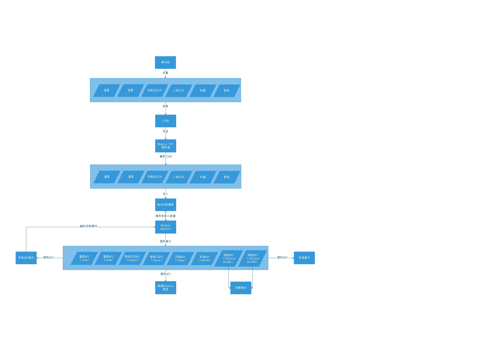

# 学年设计宠物小窝

## 端口使用

 - sht20 - I2C
 - 人体红外 - PB4
 - 舵机 - PB6
 - 蜂鸣器 - PA4
 - 1602屏幕 - PA11,PB4
 - TCRT5000 - PC3,PA5
 - LED_Blue - P10
 - LED_Green - PC8
 - LED_Red - PC7
 - LED_Yellow - PA12
 - usb串口 - USART1(PA9-TX,PA10-RX)
 - WIFI串口 - USART2(PA2-TX,PA3-RX)
 - 蓝牙串口 - UART5(PC12-TX,PD2-RX)
 - 继电器（风扇）- PA8
 - 继电器（加热垫）- PC1
 - 继电器（紫外灯）- PC2

## 空闲端口

 - PB3（JTAG)
 - PB4 (JTAG)
 - PC0
 - PC1
 - PC2
 - PC3

## 流程图展示

## 日志

 - 2017.3.28 基本结构
 - 2017.3.29 完成TCP服务端，存入mysql
 - 2017.3.30 接口完成，时间处理放到接口处处理，为tcp解决了时间处理过长问题。前端获取，折线图显示时间轴。
 - 2017.3.31 完成宠物是否在屋内的数据获取和显示，通过两张图片来进行展示。完成了手机端的编写，使用DCloud。
 - 2017.4.3 完成手表端开发
 - 2017.4.8 将一分钟发一次 改为一秒发一次 数据实时性得到保证
 - 2017.4.9 增加了数据库的功能，每次只保留最新的五个数据，其他都删除
 - 2017.4.12 微博发送最新数据
 - 2017.4.23 在test分支，测试版增加舵机，人体红外，蓝牙串口控制
 - 2017.4.27 增加风扇，和风扇api接口。
 - 2017.4.28 继电器的BUG解决，代码问题，搞了一天
 - 2017.4.29 完成邮件通知.完成流程图的绘制
 - 2017.6.13 完成自动喂食功能，提供三个选项，一天一次，一天两次和一天三次。

